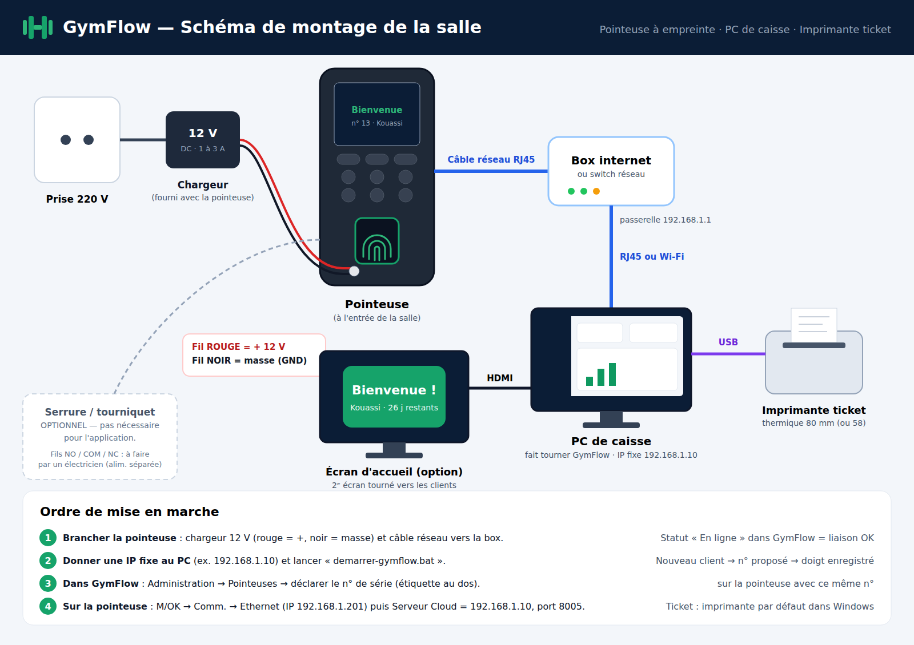

# Installation — sommaire

| Document | Pour quoi faire |
|---|---|
| **[GUIDE-CONFIGURATION-POINTEUSE.md](GUIDE-CONFIGURATION-POINTEUSE.md)** (et sa version **PDF** à imprimer) | Brancher et relier la pointeuse Hikvision, par câble ou en Wi-Fi, étape par étape |
| **[DEPLOIEMENT.md](DEPLOIEMENT.md)** | Installer GymFlow chez un client, démarrage automatique, sauvegardes, mise en ligne future |

